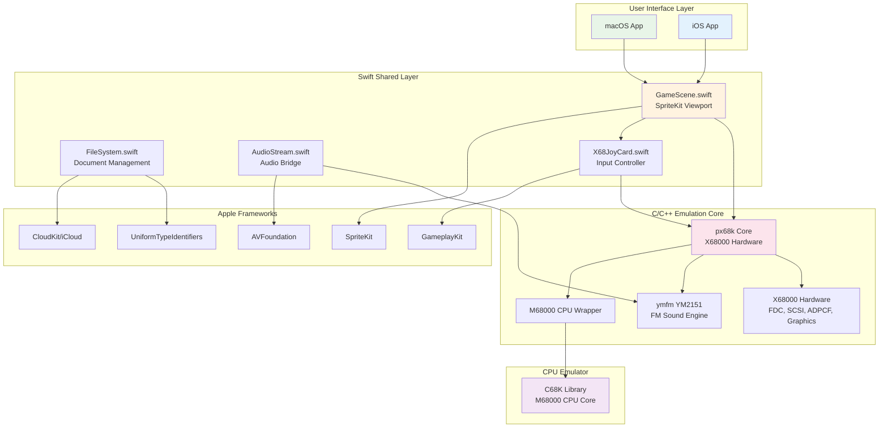
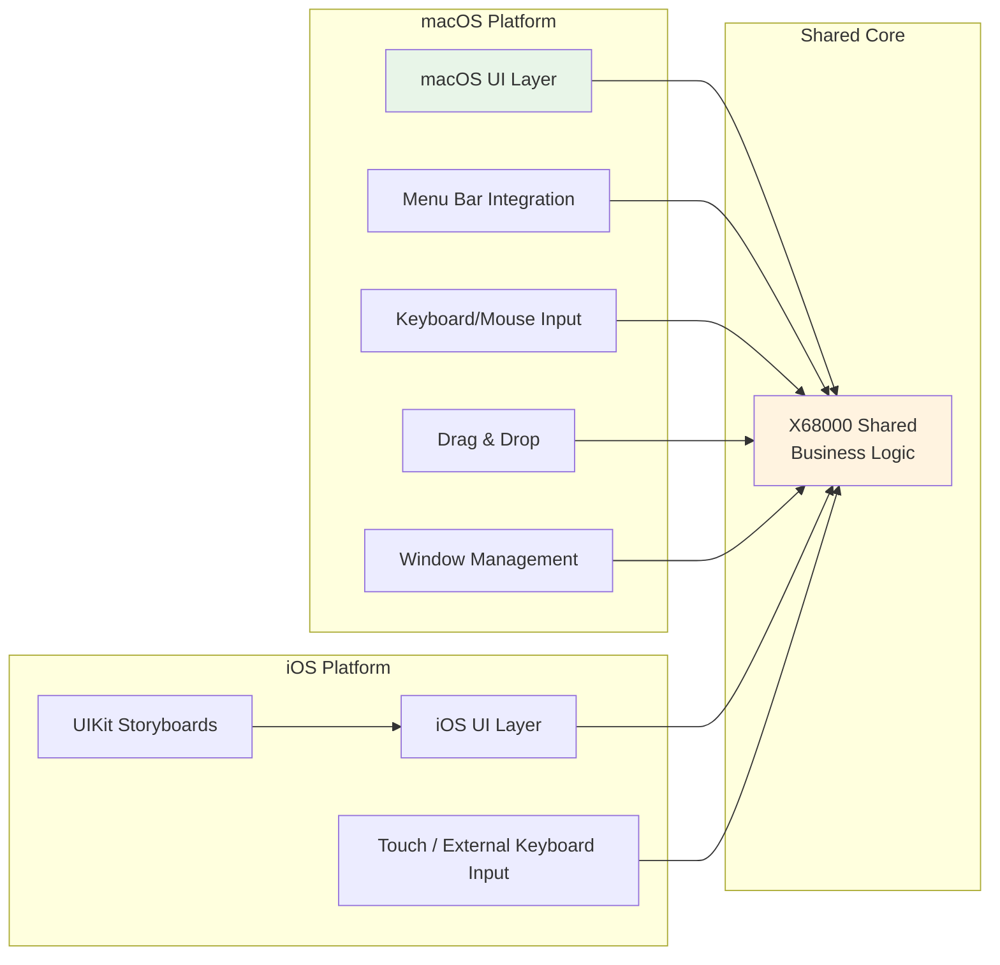
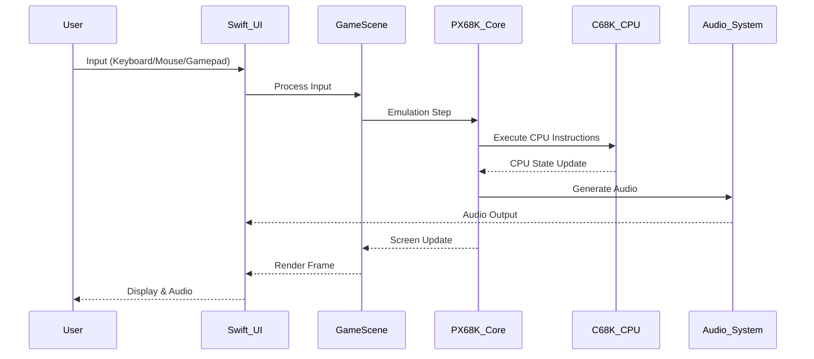
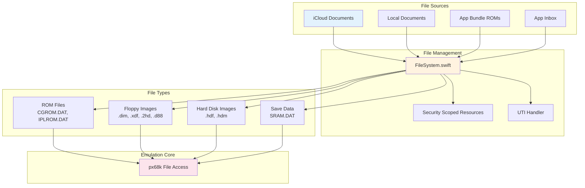
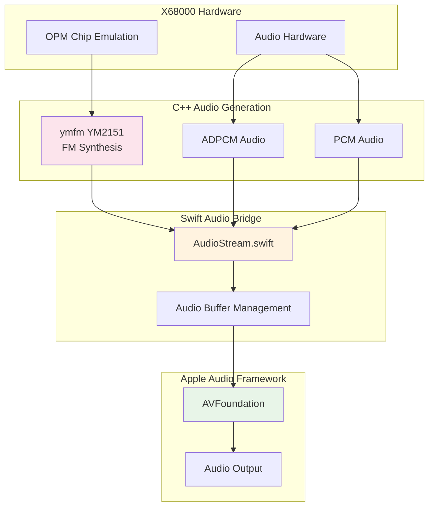
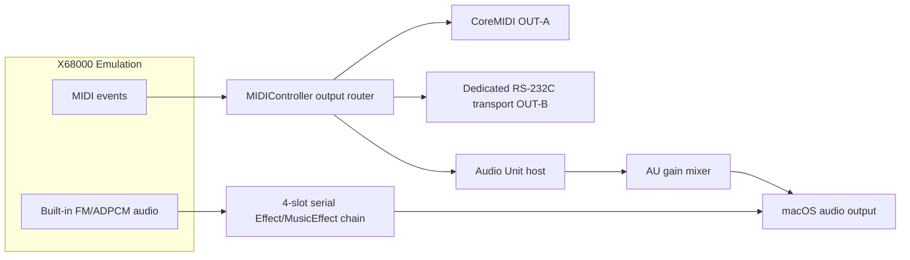
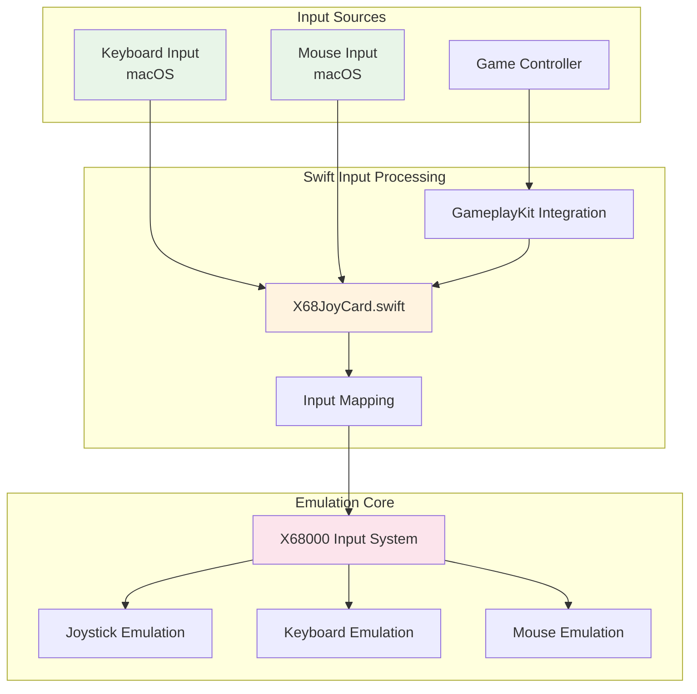
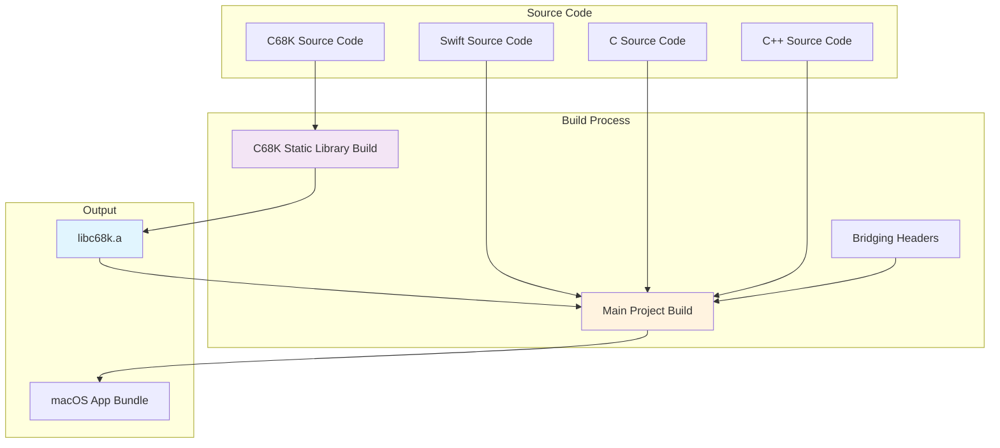
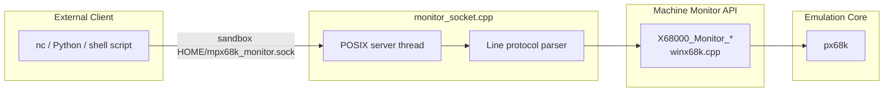

# MPX68K Software Architecture

This document describes the software architecture of MPX68K, a Sharp X68000 emulator for macOS and iOS. The active application targets are `X68000 macOS` and `X68000 iOS`; both use the shared px68k core and c68k CPU library.

## Overall System Architecture

## Platform Architecture

## Data Flow Architecture

## File System Architecture

## Audio System Architecture

## MIDI and Audio Unit Output Architecture

On macOS, `MIDIController` sends each parsed MIDI event to the selected CoreMIDI destination and, independently, to the selected RS-232C device. The C MIDI bridge records an Apple host-clock timestamp for every emitted byte; the Swift parser carries the first-byte timestamp through to the completed MIDI event. The serial transport uses a dedicated file descriptor and asynchronous transmit queue configured for 31,250 baud, 8-N-1. MIDI IN is intentionally not connected yet.

`System > MIDI Panic` and every X68000 reset path send All Sound Off and All Notes Off on all 16 channels, explicit Note Off messages for all 128 keys on every channel, and the GM System On reset SysEx to the hosted Audio Unit, CoreMIDI OUT-A, and RS-232C OUT-B. Pending delayed serial events are discarded before the panic sequence is sent.

The optional Audio Unit instrument is hosted by a separate `AVAudioEngine`. AUv3 extensions and AUv2 Music Devices are both valid instruments. AUv2 is instantiated out of process; the App Sandbox `audio-unit-host` entitlement lets macOS prompt once to open a non-sandbox-safe plug-in, the same confirmation GarageBand uses. The built-in FM/ADPCM output has a separate `AVAudioSourceNode` graph for four serial slots. Only `kAudioUnitType_Effect` and `kAudioUnitType_MusicEffect` are enumerated there; ordinary effects process audio, while Music Effects also receive the emulator's MIDI events. Effect state is persisted per slot and component, independently of the instrument state. The existing physical MIDI output delay remains applied to OUT-A/OUT-B. RS-232C has no timestamped transport, so OUT-B waits until its host-time deadline before writing the bytes. Instrument settings persist the selected Audio Unit, enabled state, and gain from -60 dB to 0 dB.

The built-in YM2151 is implemented by the `third_party/ymfm` submodule. X68000 hardware uses a 4 MHz YM2151 clock, which produces a native 62,500 Hz stream (`4 MHz / (2 prescale × 32 operators)`). `dswin.c` keeps raw YMFM and ADPCM buses in a fixed SPSC ring, and `AudioStream` converts that stream to the host device rate. Mix parameters are a separate control plane: the settings panel publishes slider values through a static coalescing mailbox, off the emulator and output-object lifecycle; the output callback applies the FM/ADPCM gains with a short ramp, and the ADPCM filter coefficients are prepared off the UI path and ramped by the producer. Neither operation rewrites queued samples or resets the output. Only a change to the output object itself (Direct AudioUnit vs. AudioQueue, device buffer size, or enabling/disabling the effect graph) is allowed to stop and rebuild the path. The default macOS path is a direct HAL AudioUnit with a 64-frame buffer; the settings panel also exposes 16, 32, 128, 256, and 512-frame choices plus an AudioQueue compatibility path. The same panel provides live per-bus FM and ADPCM trims from -24 to +24 dB in 0.5 dB steps, plus a continuous ADPCM low-pass cutoff from 3.3 to 20 kHz (3.3 kHz by default). Audio Unit volume uses the graph-preserving mixer path. The effect graph uses a Float32 source and never advances emulator state from its render callback.

## Input System Architecture

## Build System Architecture

## Key Design Patterns

### 1. Multi-Platform Strategy
- **Shared Core**: Common business logic and emulation engine
- **Platform UI**: macOS and iOS presentation layers kept separate from the shared core
- **Conditional Compilation**: Platform-specific code using `#if os()` directives

### 2. Document-Based Architecture
- **File Type Integration**: Custom UTI declarations for X68000 file formats
- **iCloud Synchronization**: Automatic document sync across devices
- **Sandboxed Access**: Security-scoped resource management

### 3. Bridge Pattern
- **Swift-C Interop**: Bridging headers for C API access from Swift
- **Audio Bridge**: AudioStream class bridges C++ audio to AVFoundation
- **Input Bridge**: Unified input system across different input methods

### 4. Emulation Core Isolation
- **Static Library**: C68K CPU emulator as independent static library
- **C/C++ Core**: px68k emulation engine in separate language layer
- **Minimal Dependencies**: Clean separation between emulation and UI layers

### 5. Machine Monitor Socket (macOS only)

The bottom of `X68000 Shared/px68k/x11/winx68k.cpp` implements a UNIX domain socket server that wraps the existing `X68000_Monitor_*` C API defined in the same file.

The server runs on a dedicated POSIX thread and is lifecycle-managed by `AppDelegate`:
- **Start**: `applicationDidFinishLaunching` calls `MonitorSocket_Start()` when `UserDefaults["monitorSocketEnabled"]` is `true` (default: `false`)
- **Stop**: `applicationWillTerminate` calls `MonitorSocket_Stop()`, which shuts down the listener, removes the socket file, and joins the thread

The socket is placed in the sandbox-writable home directory, restricted to mode `0600`, and can be overridden with `MPX68K_MONITOR_SOCK`. `SO_NOSIGPIPE` is set on each accepted client fd so that a disconnecting client cannot deliver `SIGPIPE` to the main emulator process. Live CPU, memory, and device commands require an acknowledged `PAUSE`. The no-pause `DIAG` command reads a mutex-protected snapshot produced by the emulation thread instead of racing live core state.

This architecture enables MPX68K to provide authentic X68000 emulation while maintaining modern macOS user experience standards.
