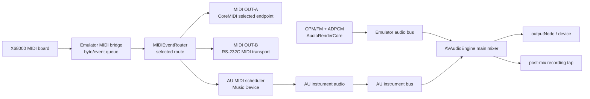

# MIDI / AU(AUv3) ホスティング HLD

- ステータス: Implemented (MVP) / Phase 2以降は継続課題
- 対象: `X68000 macOS` ターゲット
- 調査日: 2026-08-30
- 対象リビジョン: `v6` / `f59c07d`

## 1. 目的

X68000のMIDIボードから出力されるMIDIを、CoreMIDIの物理/仮想Destination（MIDI OUT-A）とRS-232C接続（MIDI OUT-B）の2系統へ、同じイベント順序で独立に送れるようにする。さらに、macOSに登録されたAU/AUv3音源へも任意で送れるようにし、AU音源をエミュレータ音源と並行する追加の音声ソースとして扱う。

この文書のMVPでは既存のAudioQueueを維持し、AU側だけを専用の`AVAudioEngine`でホストする。したがって、AUを含むpost-mix録音とエミュレータ音声を含めた単一音声グラフへの移行はPhase 2以降の課題である。

MIDI IN（CoreMIDIやRS-232CからX68000側へ戻す経路）は今回のスコープ外とする。将来追加できるSeamだけを予約し、現行リリースでは入力ポートや入力設定を公開しない。

## 2. 調査結論

### 2.1 現行MIDIの状態

| 経路 | 現状 | 判定 |
| --- | --- | --- |
| ゲストMIDI OUT → macOS CoreMIDI | `midi.c`のバイトバッファを`GameScene`が取り出し、`MIDIController`がMIDIイベント化してCoreMIDI宛に送る | 送信経路は存在する |
| CoreMIDI → ゲストMIDI IN | `MIDIInputPortCreateWithBlock`が`#if false`で無効。`GetSource()`はゼロの入力ポートへ接続を試みるだけで、受信バイトをCコアへ渡していない | 実用上未実装 |
| 宛先選択 | `GetDest()`が列挙した全Destinationへ送信する。ユーザー選択・安定ID保存・送信エラー処理がない | AU差し替え用のSeamが必要 |
| RS-232C出力 | `MIDIController`が専用host serial transportで`/dev/cu.*`/`/dev/tty.*`へraw byteを送る。31,250 baud / 8-N-1を設定する | 既存の汎用SCC経路と混在させない |
| C側WinMM出力 | macOSの`fake.c`では`midiOutOpen`が失敗を返すため、`midi.c`の直接出力は無効。macOSではSwift/CoreMIDI経路が実際の出力経路 | 二重送信ではないが、責務が分散 |

根拠となる実装は、`X68000 Shared/MIDIController.swift`の`Connect()`、`GetSource()`、`GetDest()`、`sendPackets()`、および`X68000 Shared/px68k/x68k/midi.c`の`X68000_AddMIDIBuffer()`である。MIDI受信側の`MIDI_Read()`は受信データFIFOを扱う実装になっておらず、各受信レジスタ相当のcaseも空である。

したがって調査時点では、実機MIDIへ送信できる構造はあるものの、2系統の送信やRS-232CのMIDI電気仕様まで実装されていなかった。今回のMVPで2系統の送信を追加したが、RS-232CはDIN MIDIの電気仕様（電流ループ）と異なるため、DIN MIDI機器へ直結せず、RS-232C↔MIDI変換器または対応するシリアルMIDIインターフェースを介する。実機送信は、CoreMIDI DestinationとRS-232Cループバック/変換器の両方で、バイト列・順序・欠落を確認する必要がある。

### 2.2 現行オーディオの状態

FMとADPCMは既に別バッファへ生成された後、`X68000 Shared/px68k/x11/dswin.c`の`sound_send()`でサンプルごとに加算・16-bit clipされ、PCMリングへ書かれている。つまり「FM+ADPCMのミックス」は既存経路に存在する。

現在のエミュレータ音声出力は`AudioQueue`で、`X68000_AudioCallBack()`が16-bit interleaved stereo、既定22,050 Hzのバッファを直接埋める。MVPではこの経路を維持したまま、`AudioStream.swift`にAU用の追加`AVAudioEngine`を実装している。エミュレータ音声を同じAVAudioEngineへ移す処理はまだ行っていない。

現行リングの読み書きポインタは、エミュレーションスレッドとAudioQueueコールバックの間で明確なSPSC atomic契約を持たない。また、音声不足時にAudioQueueコールバック側が追加生成する。AUホスティングでは、これをリアルタイム安全な音声Seamへ置き換える必要がある。

### 2.3 Apple API調査

採用する一次APIは次のとおり。

| 用途 | API | 設計上の意味 |
| --- | --- | --- |
| AU/AUv3の検索 | [`AVAudioUnitComponentManager`](https://developer.apple.com/documentation/avfaudio/avaudiounitcomponentmanager) | システム登録済みAudio Unitを、型・MIDI入力有無・sandbox可否などで検索する |
| AU/AUv3の非同期生成 | [`AVAudioUnit.instantiate`](https://developer.apple.com/documentation/avfaudio/avaudiounit) | AUv2/AUv3をホスト用`AVAudioUnit`として生成する。完了待ちでメインスレッドをブロックしない |
| 音声グラフ | [`AVAudioEngine`](https://developer.apple.com/documentation/avfaudio/avaudioengine) | エミュレータ音源、AU音源、Mixer、出力Nodeを同一グラフで動かす |
| AUへのMIDI | [`AUAudioUnit.scheduleMIDIEventBlock`](https://developer.apple.com/documentation/audiotoolbox/auaudiounit) | MIDI 1.0イベントをAUのサンプルタイムへスケジュールする。AUがMIDI非対応ならBlockはnil |
| 将来のCoreMIDI入力 | [`MIDIInputPortCreateWithProtocol`](https://developer.apple.com/documentation/coremidi) | 後続フェーズでMIDI 1.0 Sourceを明示的に接続する。今回のMVPでは実装・UI公開しない |
| AU音源の種類 | [Audio Unit Extensionの種類](https://developer.apple.com/documentation/avfaudio/creating-an-audio-unit-extension) | MIDIを受けて音声を出すのはMusic Device。通常のEffectはMIDI音源の代替ではない |

`AVAudioUnitMIDIInstrument`にはNote/CC/SysExの便利APIがあるが、X68000のバイト列、running status、SysEx、将来のMIDIEventListを一貫して扱うため、標準経路はAUAudioUnitのスケジュールBlockとする。`AVAudioUnitMIDIInstrument`はUIや単純なノート操作の補助に限定する。

現行の最低macOS 11を維持する場合、MIDI 1.0の`scheduleMIDIEventBlock`を基線とする。macOS 12以降では`AUMIDIEventListBlock`、macOS 13以降ではAVAudioEngineのMIDI接続用EventList APIをavailability check付きで追加できる。

## 3. 提案アーキテクチャとMVP実装

以下の設計図はPhase 2以降の目標構成である。MVPで実装済みの責務対応は次のとおり。

- MIDI OUT-A/B: `MIDIController`内にCoreMIDI選択送信と専用RS-232C transportを実装。
- AU MIDI: `MIDIController`から`AudioStream`のAU hostへイベントを転送。
- AU音声: `MPX68KAudioUnitHost`が専用`AVAudioEngine`とAU mixerを持ち、gainをAU mixerだけへ適用。既存のエミュレータAudioQueueは継続。
- UI/設定: `MIDIAndAudioSettingsWindowController`と`MIDIAndAudioSettingsPanel`でOUT-A、OUT-B、AU使用、AU選択、AU音量、AU UIを設定。`UserDefaults`へ保存。

### 3.1 モジュールとSeam

`GameScene`からCoreMIDIやAUの型を直接隠す。中心に深いModuleである`MIDIEventRouter`を置き、外側の実装差をAdapterへ閉じ込める。



設計語彙上の責務は以下のとおり。

- `MIDIEventRouter`: MIDIイベントの形式、順序、ルーティング、遅延、失敗状態を隠す深いModule。Interfaceは「イベントを投入する」「Routeを変更する」「状態を取得する」に限定する。
- `CoreMIDIOutputAdapter`: `MIDIClientRef`、Output Port、`MIDIEndpointRef`、`MIDIEventList`/`MIDIPacketList`を所有するHardware実装。
- `RS232CMIDIOutputAdapter`: RS-232Cのデバイス/専用シリアルMIDIトランスポートと固定長TX queueを所有するAdapter。baud、termios、fd、SCCの詳細をRouterへ漏らさない。
- `AUMIDIOutputAdapter`: `AUAudioUnit`のMIDIスケジュールBlockだけを所有するAU実装。CoreMIDIは知らない。
- `MIDIInputAdapter` / `GuestMIDIInputBridge`: 後続フェーズの予約Module。今回のMVPでは生成・接続・設定保存を行わない。
- `AudioRenderCore`: OPMとADPCMをエミュレーション側の1本の音声バスにし、固定長のリアルタイム安全なPCMqueueへ渡す。
- `AudioGraphController`: `AVAudioEngine`の生成、AUのattach/connect、start/stop、再構成を制御する。音声render callbackは持たない。

この構成では、CoreMIDIとRS-232Cという2つの物理出力Adapterを先に作るため、二重出力のSeamは仮説ではなく実際に検証可能になる。AUの内部DSPや外部プラグインのUIはホストModuleの外に置き、ホスト側のAU選択・表示・音量だけを設定Moduleで扱う。

### 3.2 MIDIの送信先

初期リリースでは物理出力を2つの独立スロットとして提供する。AUは物理MIDI OUTの一つには数えず、任意で同時に有効化できる音源Routeとする。

| 構成 | MIDI出力 | 音声出力 |
| --- | --- | --- |
| Off | OUT-A/OUT-Bともになし | FM+ADPCMのみ |
| OUT-Aのみ | 選択したCoreMIDI Destination 1つ | FM+ADPCMのみ |
| OUT-Bのみ | 選択したRS-232C MIDIデバイス1つ | FM+ADPCMのみ |
| OUT-A + OUT-B | CoreMIDIとRS-232Cへ同じイベントを独立送信 | FM+ADPCMのみ |
| AU追加 | 上記の物理出力に加えて選択したMusic Deviceへスケジュール | FM+ADPCM + AU音源 |

現在の「全Destinationへ自動送信」は廃止し、OUT-Aはユーザーが選択した`MIDIUniqueID`、OUT-Bはユーザーが選択したシリアルデバイス識別子を保存する。各スロットの有効/無効は独立し、Routerは同じイベントを各Adapterへ送る。片方のデバイスが失敗しても、もう片方とAU・FM+ADPCMは継続する。

RS-232C MIDIは、通常のSCC PTY/TCP/file出力とは別の専用設定として扱う。物理デバイスではraw MIDI 1.0の31,250 baud、8 data bits、no parity、1 stop bit（8-N-1）を必須条件とし、テキスト変換・改行付加・パケット化を行わない。既存のSCC Port Bを共用する場合は、通常のゲストシリアル出力とMIDIバイト列が混ざらないよう`serialMIDI`モードを排他的に設ける。推奨実装は、ゲストの汎用SCC出力とは別の専用host serial transportを持つことである。

AUの候補は`kAudioUnitType_MusicDevice`、かつ`hasMIDIInput == true`を基本とする。`kAudioUnitType_MusicEffect`は音声入力とMIDI入力を同時に扱う別の接続モデルなので、初期スコープでは対象外とし、後続のEffect slotで扱う。通常の`kAudioUnitType_Effect`はMIDI音源の代替にはならない。

### 3.3 音声グラフ（Phase 2以降の目標）

```text
AudioRenderCore (FM+ADPCM)
        │  emulator bus, Float32 stereo
        ▼
AVAudioSourceNode ──> emulatorMixer ──┐
                                     ├─> AVAudioEngine.mainMixerNode ──> outputNode
AU Music Device ─────────────────────┘                         │
                                                               └─> post-mix tap
```

- `AVAudioSourceNode`は固定のFloat32 stereo formatで作る。
- `AudioRenderCore`は既存のエミュレーションサンプルレートを保持し、必要なら固定小数点のresamplerでhost/device rateへ変換する。AU、エミュレータ、main mixerは同じhost formatで動かす。
- FM+ADPCMの従来の音量設定（`OPM_VOL`、`PCM_VOL`）を維持し、AU音量とmaster音量を別に持つ。
- AUは専用`auMixer` busを経由させ、設定画面のAU音量はこのbusのgainだけを変更する。AUプラグイン内部のpreset/parameterを直接変更する操作とは分離する。
- 既存の`AudioStream.recordingTap`はエミュレータ単体のPCMを受けている。移行後はmain mixerのpost-mix tapへ移し、画面録画にAU音声も含める。
- 音声render中にSwift allocation、lock、ログ、ファイルI/O、CoreMIDI呼び出しを行わない。

### 3.4 時刻同期（Phase 2以降の目標）

現行MIDIは`MIDIPacketList`のtimestampを0とし、Swift側の遅延は`CFAbsoluteTimeGetCurrent()`によるwall-clock queueである。AU音源とFM/ADPCMを同期させるには不十分なので、送信イベントにエミュレータ時刻とhost sample timeを付ける。

基本式は次のとおり。

```text
hostSample = audioEpochSample
           + round((emulatorTick - emulatorEpochTick) * hostSampleRate / emulatorClockRate)
```

音声engineの現在sample timeより遅れたイベントは`AUEventSampleTimeImmediate`で次のrender cycleへ送り、先行するイベントは絶対sample timeで送る。Appleの`AUAudioUnit`仕様上、render cycle中のImmediateには小さいframe offsetを加えられるが、長い先行時間を想定しない。

MVPでは既存のMIDI出力遅延を物理MIDI OUT-A/OUT-Bへ適用し、AUは即時送出する。AUをエミュレータ時刻へsample-accuratelyマップする処理は、音声グラフ統合時に実装する。

RS-232CはCoreMIDI/AUのsample timestampを持たないため、Routerが確定したイベント順序で専用TX queueへ積み、送信側が31,250 baudのbyte streamとして順次出力する。serial writeはAudio render callbackから呼ばず、serial I/O threadまたはhost control queueで処理する。

## 4. ライフサイクルと障害処理

1. `AudioGraphController`を生成し、device formatを確定する。
2. MIDI OUT-A/Bの設定を読み、CoreMIDI endpointとRS-232C transportをそれぞれ独立にopenする。RS-232Cのbaud設定が確認できない場合はOUT-Bだけを無効化する。
3. `AVAudioUnitComponentManager`でMusic Deviceを検索し、表示名ではなくAudioComponentDescriptionを保存する。
4. `AVAudioUnit.instantiate`をcontrol queueから非同期に呼び出す。
5. 生成されたAUの`musicDeviceOrEffect`、`hasMIDIInput`、`scheduleMIDIEventBlock`、sandbox可否を確認する。
6. EngineへAUをattachし、emulator source、AU、専用AU mixer、main mixer、outputをconnectする。
7. AUのrender resourcesを確保してから、RouterへAU Adapterを公開する。
8. 失敗時は失敗した出力だけをOffへ戻し、他の出力・AU・FM+ADPCMは可能な限り継続する。Route切替時には旧Adapter/AUへAll Notes Off / All Sound Offを送り、serial queueを安全に停止してから差し替える。
9. device sample rate/channel変更通知では、render中にgraphを変更せず、control queueでengineを再構成する。

Pluginの状態は、インスタンスや`MIDIEndpointRef`そのものではなく、AUのcomponent description、version、表示名、選択プリセットのfull state（取得可能な場合）を保存する。プラグインが削除・非対応・sandbox unsafeになった場合は自動ロードせず、状態画面に理由を示す。

## 5. 移行フェーズ

### Phase 0: 基準値の固定

- 現行FM only、ADPCM only、FM+ADPCMの録音波形と音量を保存する。
- MIDI loopback用のテスト（running status、Realtime、SysEx、overflow）を追加する。
- 実機がある環境でCoreMIDI送信の成否と遅延を測定する。

### Phase 1: MIDIの深いModule化と2系統出力（MVP実装済み）

- `MIDIController`の互換FacadeへCoreMIDI選択送信と専用RS-232C transportを実装した。独立Adapterへの分割は後続の整理事項。
- Destinationを`MIDIUniqueID`で選択する。
- 専用raw-byte TX queueを追加した。
- SCCまたはhost serial transportに`serialMIDI`用の31,250 baud / 8-N-1設定を追加する。
- OUT-A/OUT-Bを同時に有効化できるようにした。実機/loopback確認は未実施。
- macOSでWinMMの直接出力を無効化し、出力の責務をhostへ一本化する。

### Phase 2: AudioQueueからAVAudioEngineへ（未実装）

- `AudioRenderCore`とatomic SPSC PCM queueを追加する。
- `dswin.c`のFM+ADPCM生成をqueue producerへ移す。Audio callback側で不足分を生成しない。
- `AVAudioSourceNode`、emulatorMixer、main mixer、outputNodeを接続する。
- post-mix recording tapへ移行し、既存録画との互換性を確認する。

### Phase 3: AU Instrument（MVP実装済み、音声グラフ統合は未実装）

- AU検索、非同期instantiate、専用graph attach、MIDI scheduleを追加した。
- AUを選択して、ゲストからのNote/CC/Program Change/SysExが発音されることを確認する。
- AU専用mixerのgain UIを追加した。FM+ADPCMとの単一post-mix/clip/遅延調整はPhase 2以降。

### Phase 4: UI、永続化、回復（MVP実装済み）

- `MIDI & Audio Unit Settings`のSwiftUI画面を追加した。OUT-A/OUT-Bの有効化・宛先選択、Audio Unit使用、AU選択、AU音量、状態表示を置いた。
- AUにcustom editorがあれば`Open Plug-in UI`で別windowに表示し、ない場合は操作時にエラーを表示して安全にfallbackする。
- 設定を永続化し、起動時にCoreMIDI destination、シリアルデバイス、AU componentを再解決する。切断・休止復帰の実機検証は未実施。
- Route切替、plug-in失敗、device変更、アプリ休止復帰をテストする。

### Phase 5: MIDI IN（後続）と拡張

- CoreMIDI/RS-232CからのMIDI IN、guest RX FIFO、status/IRQを仕様確定後に実装する。今回のリリースには含めない。
- macOS 12+のMIDIEventList、MIDI 2.0/UMPをavailability guard付きで追加する。
- Music Effect、MIDI Processor、AU MIDI outputを別slotとして追加する。
- AUのプリセットfull stateを追加する。

## 6. 受け入れ条件

- AU未選択時、FM+ADPCMの出力と録画が現行基準値と許容誤差内で一致する。
- AU Music Deviceを選択すると、ゲストのMIDI Note/CC/Program Change/SysExがAUへ送られ、macOSのAU音声出力へ流れる。MVPではFM+ADPCMとは別のAudioQueue/AudioEngine経路で出力する。
- OUT-Aでは選択したCoreMIDI Destinationだけに送信され、未選択のDestinationへ送られない。
- OUT-Bでは選択したRS-232Cデバイスへraw MIDI bytesが31,250 baud / 8-N-1で送られ、PTY loopbackまたはMIDI変換器で順序・欠落が確認できる。
- OUT-AとOUT-Bを同時に有効化すると同じsequenceのイベントが両方へ届き、片方の切断・送信失敗が他方を停止させない。
- 設定画面のAudio Unit使用をOffにするとAUをinstantiateせず、Onにすると選択AUをロードできる。AU音量sliderは専用AU busだけに反映され、FM+ADPCMの音量を変えない。
- custom editorを持つAUではUIを別windowで開け、持たないAUでは安全にfallbackする。
- AUの有効/無効・交換時には全channelへAll Notes Off / All Sound Offを送る。実機でのstuck note検証は未実施。
- AUの音声render callback中にCoreMIDI/RS-232C送信は行わない。MVPの既存AudioQueue側のリアルタイム安全性は既存実装の範囲であり、Phase 2で整理する。
- audio underrun/overrun、MIDI queue overflow、CoreMIDI/RS-232C送信失敗、AU instantiate/render失敗がMonitorで観測できる。
- macOS 11の既存deployment targetで基線機能がビルドできる。

MIDI INはこの受け入れ条件に含めない。将来フェーズの別受け入れ条件として、CoreMIDI/RS-232C inputからguest RX FIFOへ安全に渡せることを定義する。

## 7. 未解決事項

- CZ-6BM1のRX data/status registerと受信割り込みの正確な互換仕様は、現行`MIDI_Read()`に実装がないため、実機資料または既存X68000 MIDIソフトで確定する必要がある。
- 22,050 Hzのエミュレータレートをhost rateへresampleする方式は、linear resamplerで始めて音質を確認する。必要なら高品質resamplerへ置き換える。
- AUv3のsandbox可否、アーキテクチャ、AU validation、プラグイン固有のSysEx制限は、component metadataを表示し、instantiate時に個別エラーとして扱う。
- RS-232C出力は専用host serial transport方式を採用した。デバイスパス、RS-232C↔MIDI変換器の電気仕様、実機での31,250 baud確認は未実施。
- 通常のゲストSCC Port Bとは別の専用transportを使う。共用の`serialMIDI`排他モードは採用していない。
- AU音量の表示範囲は`-60 dB ... 0 dB`とし、`AVAudioMixerNode`の0〜1.0出力音量範囲に合わせる。初期値は0 dB。
- MIDI INのRX register/status/IRQ仕様と、外部入力をゲストだけへ渡すかAUへThruするかは後続フェーズで確定する。

## 8. 参照

- 現行MIDI送信: `X68000 Shared/MIDIController.swift`
- 現行MIDI C bridge: `X68000 Shared/px68k/x68k/midi.c`
- 現行SCC/RS-232C: `X68000 Shared/SCCManager.swift`、`X68000 Shared/px68k/x68k/scc.c`、`X68000 Shared/px68k/x68k/scc_enhanced.h`
- 現行FM+ADPCM mix: `X68000 Shared/px68k/x11/dswin.c`
- 現行OPM生成: `X68000 Shared/px68k/fmgen/fmg_wrap.cpp`
- 現行ADPCM生成: `X68000 Shared/px68k/x68k/adpcm.c`
- 現行AudioQueue: `X68000 Shared/AudioStream.swift`
- 現行初期化・固定step接続: `X68000 Shared/GameScene.swift`、`X68000 Shared/px68k/x11/winx68k.cpp`
- 詳細設計: [MIDI_AU_HOSTING_LLD.md](MIDI_AU_HOSTING_LLD.md)
